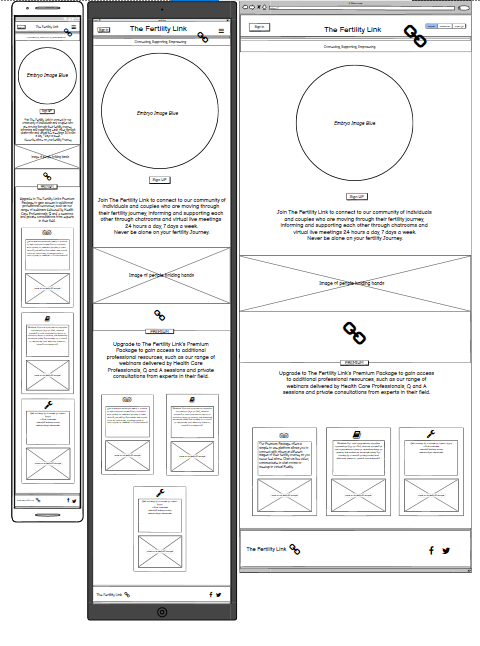
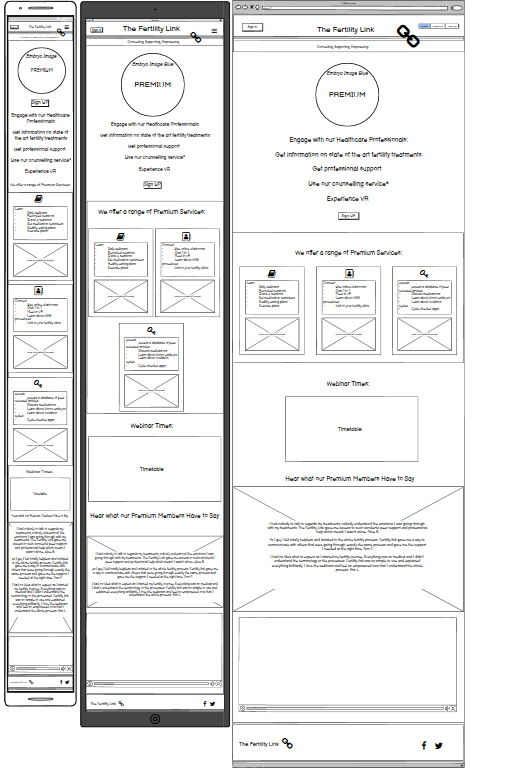
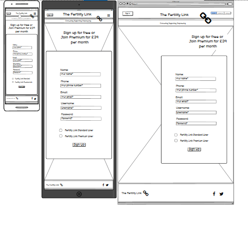

#The Fertility Link

##Project Overview

The Fertility Link project allows individuals and couples in the UK who are considering, starting, going through or have concluded their fertility treatment/s to connect with each other for peer support through the medium of chatrooms and 1-1 video conferencing. There is also the option for a premium subscription service that gives access to professional support from health care professionals via webinars, Q and A sessions, information libraries, chatrooms, 1-1 video conferencing and virtual reality. This service does not currently exist in the UK and there is a distinct lack of accessible peer/professional support or a dedicated website for those going through their fertility journey so the project offers a solution to this need.

## Project Goals 

### User Goals
- To get access to peer support through their fertility journey via chatrooms and video conferencing.
- To get access to professional practitioner support through their fertility journey.
- To get access to peers and healthcare practitioners through the medium of a virtual reality platform to enhance communication.
- To get access to webinars hosted by healthcare practitioners for information on fertility treatments and the role of specific healthcare practitioners in the fertility team.
- To get access to recorded webinars for reference. 
- To gain access to a library of maintained, up to date information on fertility treatments, procedures and medication.
- To get access to a selection of fertility apps, healthy eating advice and exercise plans to benefit fertility.

### Site Owner Goals
- To give potential users access to chatrooms, video conferencing and virtual reality.
- To provide information about the difference between signing up as a standard user and as a premium subscriber.
- To generate an income stream through premium subscriptions.
- To offer additional support to subscribers by offering paid access to counselling services and 1-1 consultations from health care practitioners, information libraries, apps to help with fertility, exercise plans and  .
- To provide a way for returning subscribers to sign back into the service.
- To provide a site that is presented with eye catching images.
- To grow a database of subscribers which can then be used for targeted advertising. This could be via email or withing the platform itself for additional services and products relating to fertility and babies/new families therefore generating a further income stream. – FOR FURTHER SITE DEVELOPOMENT

## User Experience

### Target Audience
- Individuals and couples that are wanting a website/service that offers a wide range of support with regards to their fertility journey no matter what stage they are at in one online site.
- Individuals and couples who wish to join a network of peers that are going through fertility treatments to gain peer support through their fertility journey.
- Individuals and couples looking for professional peer support.
- Individuals and couples that may require a counselling service.

 
### User Requirements and Expectations

- An intuitive and simple navigation system.
- To quickly and easily be able to find relevant information about the site and its services.
- Links and functions that work correctly as expected by the user.
- Professional presentation and a visually appealing design over a range of screen sizes.
- An easy way to sign up to the service as a standard user or as a premium subscriber.
- Content that is easy to digest and tells the user what services are available.
- A way to easily subscribe to the standard or premium service.
- A site that takes into account accessibility.

### User Stories

#### First-time User 
1. As a first time user, I want to know what The Fertility Link is offering.
2. As a first time user, I want to know what the standard subscription includes.
3. As a first time user, I want to know what the premium subscription includes.
4. As a first time user, I want an example of the webinar timetable.
5. As a first time user, I want to know about other people’s experiences of the platform. 
6. As a first time user, I want to know where to sign up.

#### Returning User
6. As a returning user, I want to be able to sign into the service.
7. As a returning user, I want to be able to contact the service provider.

#### Site Owner 
8. As the site owner, I want users to quickly know what The Fertility Link is offering.
9. As the site owner, I want users to quickly access information that will give them and informed choice about signing up to the standard or premium service. 
10. As the site owner, I want the users to be able to contact the Fertility Link.
11. As the site owner I want the users to feel that the website is professional looking and will therefore offer a professional service.

## Design

### Design Choices
The website will be visited by all genders whether as individuals or couples and therefore provides a good balance between masculinity and femininity in the image and colour choices. The website design is developed so that it showcases the benefits and services of signing up to the premium subscription and steers new users towards the signup page. 
The link logo in the header was used so that the site becomes instantly recognisable by the users.

### Colour
For the site the colours pink and blue are selected to represent the desire for a birth of a boy or girl from the potential subscribers to elicit a positive emotion.
Black is selected within the web pages to make images and text pop and be visually appealing. This was influenced by https://www.awwwards.com/sites/de-fortuyne which is a nominee for the awwwards website for web design. 
A soft/light grey was selected to offset the black and to allow a sharp contrasting black font to be utilised.
White is used for the logo to give it a high contrast.
Colormind was used for the colour selection.

### Fonts
Google fonts has been imported and "I HAVE NOT DECIEDED WHICH FONT TO USE YET – POSSIBLY ROBERTO" has been used for all the text inside the website with sans-serif selected for if a browser does not support the prior font.

### Structure
The page is structured in a user friendly, easily recognised, simple format. The first time user sees a typical navigation bar at the top of the page, with a sign in button to the left and a navigation bar to the right.
The title The Fertility Link is displayed clearly with a sub heading of Connecting, Supporting, Empowering. 

The website consists of five separate pages: 
- A homepage consisting of a section about The Fertility Link and a signup button. A second section with information about the premium subscription presented in 3 cards with images. A Premium signup button is also displayed. 
- A Premium page with a section with more precise details about what the premium subscription offers and a signup button. Three cards with bulleted details further describing the features of the service. A table showing webinar times and what health professionals will be presenting. A section with user experiences. A video showing a user experience.
- A sign up page with a sign up form
- A sign in page with a sign in form
- A contact page with a contact form

### Wireframes

Homepage

 

Premium wireframe

 

Contact wireframe

 

## Technologies Used

### Languages
- HTML
- CSS

### Tools
- Git
- GitHub
- Gitpod
- Balsamiq
- Bootstrap
- Google Fonts
- Colormind
- Font Awesome

## Features
- The website consists of 5 pages and twelves features

### Logo and Navigation Bar
- Features across all five pages
- The navbar responds fully and includes links to the Homepage, Premium, Sign in, Sign up and Contact page
- It allows users to easily navigate around the website

### Introduction to services on home page
- Presents a brief description/overview of the services The Fertility Link provides
- Presents the user with a link to sign up
- User stories fulfilled: 1, 6, 9

